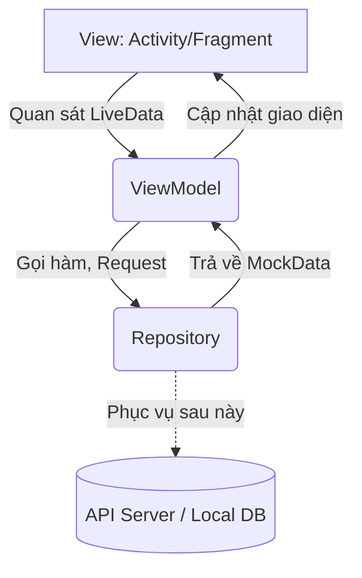
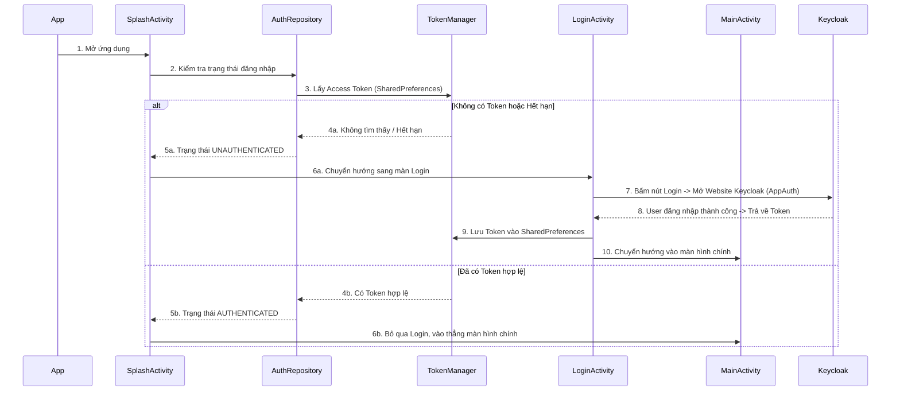
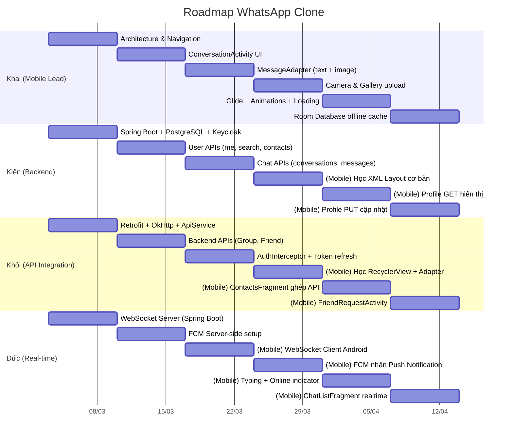

# 📱 WhatsApp Clone - Đồ Án Lập Trình Di Động (Nhóm 4)

Dự án này là một bản sao (clone) của ứng dụng nhắn tin WhatsApp, được xây dựng cho hệ điều hành Android. Hiện tại, source code cung cấp sẵn **Bộ khung (Skeleton)** phía Client (Mobile App) hoàn chỉnh về giao diện (UI) và luồng hoạt động. 

Repository này sẽ là nơi làm việc chung của cả nhóm. Vui lòng đọc kỹ tài liệu này trước khi bắt đầu code.

---

## 🎯 Phần 1: Báo Cáo Source Base Hiện Tại (Architecture & Workflow)

Dự án hiện tại được xây dựng theo mô hình **MVVM (Model - View - ViewModel)** khuyên dùng bởi Google. Đây là chuẩn công nghiệp hiện nay cho app Android.



*   **View (UI):** Gồm Activity và Fragment. Chỉ chịu trách nhiệm hiển thị giao diện và nhận tương tác từ người dùng (click, gõ phím...). **Tuyệt đối không chứa logic xử lý nghiệp vụ hay gọi API trực tiếp ở đây.**
*   **ViewModel:** Nơi chứa logic xử lý (ví dụ: người dùng bấm nút thì ViewModel quyết định làm gì tiếp theo). Nó giữ trạng thái dữ liệu (bằng `LiveData` hoặc `StateFlow`) để View tự động cập nhật khi dữ liệu thay đổi.
*   **Repository:** Tầng giao tiếp với dữ liệu. Nhiệm vụ của nó là cung cấp dữ liệu cho ViewModel, bất kể dữ liệu đó đến từ đâu (Local Database, API thật, hay Mock Data). Hiện tại, nó đang trả về Mock Data.

### 1.1. Luồng Hoạt Động Ứng Dụng (Workflow)

Dưới đây là luồng hoạt động chính khi người dùng mở ứng dụng lên:



### 1.2. Kiến Thức Cần Nắm Vững (Prerequisites)

Để phát triển tiếp dự án này, các thành viên (đặc biệt là team Frontend) cần tìm hiểu và nắm chắc các kiến thức sau:

1.  **Core Android:**
    *   **Vòng đời (Lifecycle):** Hiểu rõ vòng đời của `Activity` và `Fragment` (onCreate, onStart, onResume...) để tránh memory leak.
    *   **Intent:** Cách chuyển đổi giữa các màn hình và truyền dữ liệu cơ bản.
    *   **SharedPreferences:** Cách luân chuyển, đọc/ghi dữ liệu tạm thời (đang dùng để lưu Access/Refresh Token).
2.  **UI & Components:**
    *   **RecyclerView & Adapter:** Rất quan trọng! Hầu hết mọi danh sách (danh sách chat, danh bạ, tin nhắn) đều dùng `RecyclerView`. Cần hiểu cách viết `Adapter` và `ViewHolder`.
    *   **ViewBinding:** Thay thế cho `findViewById` truyền thống. Giúp linh kết giữa logic Java và file XML layout an toàn và code sạch hơn.
    *   **BottomNavigationView & ViewPager2:** Dùng để làm các tab chức năng ở dưới đáy màn hình chính.
3.  **Kiến trúc MVVM & Jetpack Component:**
    *   Cách khởi tạo và sử dụng `ViewModel`.
    *   Cách dùng `LiveData` (hoặc `MutableLiveData`) để View có thể `Observe` (quan sát) và tự động cập nhật UI khi có dữ liệu mới từ data layer.
4.  **Network & Security (Chuẩn bị cho bước tiếp theo):**
    *   **Retrofit & OkHttp:** Đây là 2 thư viện lõi dùng để call API đến Spring Boot Server sau này. Cần biết cách định nghĩa các Interface API, tạo Retrofit Client, và thêm Headers (Interceptors).
    *   **OAuth2 / OpenID Connect:** Hiểu luồng cơ bản (Authorization Code Flow với PKCE) mà thư viện `AppAuth` đang dùng để liên kết bảo mật với Keycloak.

### 1.3. Cấu Trúc Mã Nguồn & Mục Đích Từng File

Source code đã được phân chia theo kiến trúc package (`package by feature/layer`) để dễ quản lý.

#### 🗂️ `network/` (Tầng Mạng & Security)
Chuyên xử lý cấu hình kết nối server và các logic bảo mật API chung.
*   **`KeycloakConfig.java`**: File chứa hằng số cấu hình: Server URL của Keycloak, Realm, Client ID, Redirect URI.
*   **`TokenManager.java`**: Lớp tiện ích (Utility) dùng SharedPreferences để `saveToken()`, `getAccessToken()`, `clearToken()`.
*   **`AuthInterceptor.java`**: (Quan trọng về sau) Dùng với OkHttp. Tự động chèn header `Authorization: Bearer <token>` vào mọi API requests gửi lên Server.

#### 🗂️ `model/` (Dữ liệu - Data Entities)
Các class POJO thuần tuý đại diện cho các Object trong ứng dụng (tương tự như các bảng dưới Database).
*   **`User.java`**: Người dùng (ID, tên, sđt, avatar...).
*   **`Message.java`**: Một tin nhắn (Nội dung, thời gian, thuộc về ai, loại tin nhắn: Text/Image, Trạng thái: Đã gửi/Đã xem...).
*   **`Conversation.java`**: Một đoạn chat (chứa `User` đối tác và `Message` mới nhất để hiện ở trang chủ).
*   **`Group.java`**: Nhóm chat.
*   **`FriendRequest.java`**, **`Notification.java`**: Mô hình yêu cầu kết bạn và thông báo hệ thống.

#### 🗂️ `repository/` (Tầng kết nối dữ liệu - Data Layer)
Hiện tại dự án chưa có API, nên tầng này đang làm nhiệm vụ "giả mạo" Server (ngoại trừ AuthRepository đang kết nối Keycloak thật).
*   **`AuthRepository.java`**: Trung tâm xử lý logic OAuth2 bằng thư viện AppAuth (chuẩn bị Request, gửi đến Keycloak, nhận Token đổi trả).
*   **`ChatRepository.java`**: Chứa các hàm `getConversations()`, `getMessages(...)`. Nó đang gọi đến `MockData`.
*   **`UserRepository.java`**: Lấy danh bạ bạn bè, danh sách block...
*   **`NotificationRepository.java`**: Lấy thông báo giả.
> 🔥 **Nhiệm vụ của team API:** Sau khi Backend có API thật, các bạn sẽ tạo các `Interface Retrofit` và thay đổi các `Repository` này. Xoá việc trả về `MockData`, thay vào đó là gọi Retrofit `enqueue()` để lấy Data JSON thật về.

#### 🗂️ `util/` (Công cụ dùng chung - Utilities)
*   **`MockData.java`**: File này chứa dữ liệu tĩnh cực lớn (giả lập các user, avatar, tin nhắn có sẵn) giúp Frontend có thể chạy và thiết kế UI mượt mà ngay cả khi chưa có Backend. Khi có Server thật, file này sẽ bị xoá đi.

#### 🗂️ `viewmodel/` (Điều phối Logic Màn Hình - Presentation Layer)
Nằm tầng giữa, kết nối View và Repository.
*   **`AuthViewModel.java`**: ViewModel dùng để quản lý trạng thái (`LOADING`, `AUTHENTICATED`, `UNAUTHENTICATED`) cung cấp cho View.
*   Mỗi màn hình có 1 ViewModel tương ứng (Ví dụ: `ChatListViewModel`, `ConversationViewModel`, `ContactsViewModel`...). Các class này làm nhiệm vụ: `View` gọi -> `ViewModel` báo `Repository` lấy dữ liệu -> Có dữ liệu thì nạp vào `LiveData` -> `View` tự động thấy `LiveData` đổi và vẽ lại UI lên màn hình.

#### 🗂️ `view/` (Giao Diện UI)
Chứa toàn bộ các File để vẽ ra màn hình app, phân rã thành Activity, Fragment và Adapter.

**`view/activity/` (Các màn hình độc lập hoàn chỉnh)**
*   **`SplashActivity.java`**: Màn hình chớp lên khi mở app, có logo. Nghĩa vụ chính: Hỏi `AuthViewModel` xem có Token chưa để quyết định vào trang nào tiếp.
*   **`LoginActivity.java`**: Hiện nút đăng nhập bằng Keycloak. Khi bấm, mở in-app browser chạy OAuth2.
*   **`MainActivity.java`**: Khu vực xương sống. Có thanh điều hướng `BottomNavigationView` ở đáy để switch qua lại giữa 4 tab mà không phải mở Activity mới.
*   **`ConversationActivity.java`**: Màn hình khung chat nhắn tin (1-to-1 hoặc Group). Tính năng phức tạp nhất sẽ nằm ở đây.
*   Và các màn hình lẻ khác: `UserProfileActivity` (Xem thông tin bạn bè), `BlockedUsersActivity`, `CreateGroupActivity`...

**`view/fragment/` (Các mảnh màn hình nhúng vào MainActivity)**
Tương ứng với 4 nút dưới đáy màn hình của `MainActivity`:
*   **`ChatListFragment.java`**: Tab 1 - HIển thị lịch sử chat.
*   **`ContactsFragment.java`**: Tab 2 - Danh bạ bạn bè.
*   **`MyProfileFragment.java`**: Tab 3 - Thông tin cá nhân của mình.
*   **`SettingsFragment.java`**: Tab 4 - Cài đặt (Bong nổi ngôn ngữ, theme, v.v..). Nút Đăng Xuất nằm tại đây (gọi AuthRepository để xóa Token).

**`view/adapter/` (Bộ ghép nối dữ liệu vào Danh sách UI)**
Như đã nói, Android dùng `RecyclerView`, yêu cầu phải có Adapter hướng dẫn nó "Dữ liệu X thì vẽ lên Khung UI kiểu Y như thế nào".
*   **`MessageAdapter.java`**: Rất quan trọng! Xử lý logic chia 2 loại tin nhắn: Nếu `senderId` là Id của bản thân -> Vẽ cái khung xanh lá nằm sát mép phải. Nếu `senderId` là người khác -> Vẽ khung trắng nằm sát mép trái có kèm hình Avatar.
*   **`ConversationAdapter.java`**: Vẽ Danh sách lịch sử chat ở Tab 1.
*   Các file Adapter khác tương tự (`UserAdapter`, `FriendRequestAdapter`...) dùng để render Layout cho các List khác nhau.

**=> Tóm lại:** Source này là "**vỏ đẹp, ruột giả**". Phần UI và Flow gần như đã setup chuẩn 100%. Công việc tiếp theo của các bạn là gỡ các class gọi `MockData` ra, và thay thế bằng việc call API Retrofit.

---

## 📋 Phần 2: Kế Hoạch & Phân Chia Công Việc (Cân bằng Mobile)

Vì là đồ án môn học Android, **TẤT CẢ thành viên đều bắt buộc phải có phần đóng góp code Mobile**. Tuy nhiên, để tận dụng thế mạnh từng người, nhóm sẽ có **1 Mobile Lead (gánh phần UI/logic khó nhất của app)** và **3 thành viên còn lại tập trung làm Backend/Service nhưng vẫn sẽ code các màn hình Mobile cơ bản** để hiểu rõ cách app hoạt động.

### 👤 Thành Viên 1: Mobile Lead (Khai)
Cân phần lõi của ứng dụng Mobile.
*   **Công nghệ:** Android MVVM, Room Database, Glide, Camera Intent.
*   **Nhiệm vụ Mobile (Nặng):**
    *   Xây dựng kiến trúc dự án (Đã xong phần khung).
    *   Xử lý màn hình cực khó: `ConversationActivity` (Khung chat nhắn tin thực tế, bàn phím không che tin nhắn) và `MessageAdapter` (Tin nhắn văn bản/hình ảnh 2 bên).
    *   Sử dụng thư viện `Room` Database lưu local tin nhắn offline.
    *   Xử lý phần Media: Truy cập Bộ sưu tập/Camera để upload Avatar và chụp ảnh.
    *   Hỗ trợ review code Android cho 3 bạn còn lại.

### 👤 Thành Viên 2: Backend Core (Kiên)
Lo Database và Server gốc
*   **Công nghệ:** Spring Boot, PostgreSQL, Keycloak Server.
*   **Nhiệm vụ Backend:**
    *   Thiết kế CSDL (PostgreSQL), xây dựng Server Spring Boot chứa REST API cơ bản (User, Conversation).
    *   Cấu hình Keycloak Server để quản lý tài khoản.
*   **Nhiệm vụ Mobile:**
    *   Tự thiết kế/tinh chỉnh file giao diện tĩnh (XML) cho màn hình Hồ sơ cá nhân (`MyProfileFragment`, `UserProfileActivity`).
    *   Ghép API: Gọi `GET` để lấy thông tin của mình hiện lên app, gọi `PUT` gửi thông tin cập nhật lên server.

### 👤 Thành Viên 3: API Integration (Khôi)
Thợ nối ống mạng, kiêm luôn màn hình danh sách.
*   **Nhiệm vụ Mạng/Backend:**
    *   Thiết lập mạng tĩnh: `RetrofitClient`, `ApiService`, truyền Token của Keycloak vào Header (`AuthInterceptor`).
    *   Viết API trên Spring Boot cho tính năng Nhóm (Groups) và Lời mời kết bạn (Friend Requests).
*   **Nhiệm vụ Mobile:**
    *   Làm quen với kỹ thuật Danh sách trong Android (`RecyclerView`, `Adapter`).
    *   Đảm nhận màn hình Danh bạ (`ContactsFragment`) và Kết bạn (`FriendRequestActivity`). 
    *   Ghép API: Gọi server lấy danh sách bạn bè dạng mảng JSON và đổ dữ liệu đó lên Adapter để sinh ra danh sách hiển thị trên app.

### 👤 Thành Viên 4: Real-time (Đức)
Giữ kết nối liên tục, làm chức năng thông báo.
*   **Công nghệ:** WebSocket, Firebase Cloud Messaging (FCM).
*   **Nhiệm vụ Realtime:**
    *   Code WebSocket Server trên Spring Boot. 
    *   Code hệ thống FCM để bắn Push Notification về máy (Server-side).
*   **Nhiệm vụ Mobile:**
    *   Khởi tạo `WebSocketClient` bên phía Android, lắng nghe sự kiện "có tin nhắn mới".
    *   Ghép tính năng "Đang gõ..." (Typing indicator) và đổi trạng thái "Trực tuyến".
    *   Đảm nhận màn hình Danh sách chat (`ChatListFragment`). Khi có tin nhắn mới báo về qua WebSocket thì sắp xếp lại danh sách đẩy cuộc hội thoại lên trên cùng.
    *   Hiển thị thông báo (Notification) trên thanh trạng thái điện thoại khi để app chạy ngầm.
---

### 🗺️ Roadmap phát triển (6 Sprint × 1 tuần)

Mỗi Sprint kéo dài **1 tuần**. Cuối mỗi Sprint, nhóm họp nhanh 15 phút để demo tiến độ và merge code vào `develop`.



---

#### 🏃 Sprint 1 — Nền móng (Tuần 1)
> Mục tiêu: Mỗi người dựng xong "xương sống" phần mình phụ trách.

| Thành viên | Việc cần làm | Output kiểm tra |
|---|---|---|
| **Khai** | Rà soát lại Architecture, fix bug nếu có. Hoàn thiện Navigation giữa các Fragment/Activity | App chạy được, chuyển tab mượt |
| **Kiên** | Init dự án Spring Boot, tạo DB PostgreSQL, cấu hình Keycloak (Realm + Client) | Server start không lỗi, Keycloak login được |
| **Khôi** | Thêm Retrofit + Gson dependency, tạo `RetrofitClient.java` + `ApiService.java` interface rỗng | Build thành công, class tồn tại |
| **Đức** | Setup module WebSocket trên Spring Boot (STOMP hoặc raw). Test bắn/nhận message đơn giản | Dùng Postman/wscat gửi message thấy server echo lại |

✅ **Checkpoint:** Server chạy + App chạy + Retrofit sẵn sàng + WebSocket echo.

---

#### 🏃 Sprint 2 — API cốt lõi (Tuần 2)
> Mục tiêu: Backend có API thật để FE bắt đầu gọi.

| Thành viên | Việc cần làm | Output kiểm tra |
|---|---|---|
| **Khai** | Bắt đầu code `ConversationActivity` (giao diện chat, xử lý bàn phím, cuộn list) | Mở màn chat thấy UI đúng, bàn phím không che |
| **Kiên** | Viết API: `GET /api/users/me`, `GET /api/users/search`, `GET /api/users/contacts` | Dùng Postman gọi 3 endpoint trả JSON đúng |
| **Khôi** | Viết API Backend cho Group + Friend Request. Bắt đầu code `AuthInterceptor` gắn token | API Group/Friend trả JSON, Token chèn vào Header |
| **Đức** | Setup Firebase project, cấu hình FCM trên Server để gửi được Push test | Bấm nút test trên server → Điện thoại nhận notification |

✅ **Checkpoint:** 3+ API hoạt động + Chat UI khung cơ bản + FCM test thành công.

---

#### 🏃 Sprint 3 — Kết nối đầu tiên (Tuần 3)
> Mục tiêu: Mobile lần đầu tiên gọi API thật thay vì MockData.

| Thành viên | Việc cần làm | Output kiểm tra |
|---|---|---|
| **Khai** | Code `MessageAdapter` phân biệt tin gửi/nhận, text/image. Code giao diện gửi tin nhắn | Mở chat, thấy bong bóng 2 bên đúng màu |
| **Kiên** | Viết API: `GET /api/conversations`, `POST /api/messages`. **(Mobile)** Bắt đầu học cách tạo file XML layout | API chat hoạt động, biết tạo XML cơ bản |
| **Khôi** | Hoàn thiện Token refresh flow. **(Mobile)** Học `RecyclerView` + `Adapter` pattern | Token tự renew khi hết hạn, hiểu RecyclerView |
| **Đức** | **(Mobile)** Tạo `WebSocketClient` trên Android kết nối tới server. Nhận được event test | App log ra "Connected" + nhận message từ server |

✅ **Checkpoint:** App gọi API thật lần đầu + WebSocket Client kết nối + MessageAdapter render.

---

#### 🏃 Sprint 4 — Ghép Mobile (Tuần 4)
> Mục tiêu: 3 bạn Backend bắt đầu code phần Mobile của mình.

| Thành viên | Việc cần làm | Output kiểm tra |
|---|---|---|
| **Khai** | Code Camera/Gallery Intent chọn ảnh. Nén Bitmap và gửi Multipart lên server | Chụp ảnh → thấy ảnh xuất hiện trong chat |
| **Kiên** | **(Mobile)** Thiết kế `fragment_my_profile.xml`. Tạo `ProfileViewModel`, gọi `GET /api/users/me` | Mở tab Hồ sơ, thấy tên + SĐT lấy từ server |
| **Khôi** | **(Mobile)** Code `ContactsFragment` + `ContactAdapter`. Gọi API lấy danh sách bạn bè | Mở tab Danh bạ, thấy list bạn bè từ server |
| **Đức** | **(Mobile)** Tích hợp FCM trên Android nhận Push khi app chạy ngầm. Code `ChatListFragment` | Tắt app, nhận notification. List chat hiển thị |

✅ **Checkpoint:** 4/4 thành viên đều có output Mobile chạy trên máy thật.

---

#### 🏃 Sprint 5 — Hoàn thiện tính năng (Tuần 5)
> Mục tiêu: Mỗi người hoàn thiện nốt phần Mobile + fix bug.

| Thành viên | Việc cần làm | Output kiểm tra |
|---|---|---|
| **Khai** | Tích hợp Glide load ảnh URL. Thêm animation chuyển trang, skeleton loading | Ảnh load mượt, chuyển trang có hiệu ứng |
| **Kiên** | **(Mobile)** Ghép nút "Lưu" trên Profile gọi `PUT`. Xử lý ProgressBar + Toast thành công/lỗi | Sửa tên → bấm Lưu → thấy xoay → Toast thành công |
| **Khôi** | **(Mobile)** Code `FriendRequestActivity`. Thêm SwipeRefreshLayout + Empty State cho danh bạ | Kéo làm mới thấy loading, danh sách trống có thông báo |
| **Đức** | **(Mobile)** Ghép "Đang gõ..." + "Trực tuyến". Cập nhật `ChatListFragment` đẩy chat mới lên đầu | Gõ ở máy A → máy B hiện "Đang gõ...", chat mới nhảy lên trên |

✅ **Checkpoint:** Tất cả tính năng chính hoạt động end-to-end.

---

#### 🏃 Sprint 6 — Polish & Nộp bài (Tuần 6)
> Mục tiêu: Sửa bug, test toàn diện, chuẩn bị báo cáo.

| Thành viên | Việc cần làm | Output kiểm tra |
|---|---|---|
| **Khai** | Setup Room Database lưu cache offline. Fix bug tổng, review code cả nhóm | Tắt mạng vẫn thấy tin nhắn cũ |
| **Kiên** | Deploy server lên môi trường test. Viết tài liệu API cho nhóm | Server chạy ổn định, có docs API |
| **Khôi** | Test toàn bộ luồng Token (login → expired → refresh → logout). Fix edge cases | Đăng nhập/Đăng xuất mượt, token không bị lỗi |
| **Đức** | Test WebSocket reconnect khi mất mạng. Test FCM đa thiết bị | Mất mạng → có mạng lại tự kết nối, 2 máy đều nhận noti |

✅ **Checkpoint cuối:** App chạy ổn trên 2+ thiết bị, demo được luồng đầy đủ, sẵn sàng nộp bài.

---

## 🌳 Phần 3: Quy Tắc Git & Version Control

Để tránh xung đột code (Conflict) đến mức đập máy nội bộ, nhóm tuân thủ chặt Flow làm việc sau:

### 3.1. Phân chia Nhánh (Branching Model)
*   **`main`**: Nhánh CHÍNH (Production). Code ở đây bắt buộc phải chạy được, không lỗi build. TUYỆT ĐỐI KHÔNG commit thẳng lên main.
*   **`develop`**: Nhánh TỔNG HỢP tính năng. Code mới sẽ về đây test trước.
*   Nhánh Tính năng cá nhân: **`feature/tên-ngắn-chức-năng`**. Ví dụ: 
    *   `feature/tv2-retrofit-setup`
    *   `feature/tv4-websocket-chat`
    *   `feature/tv3-glide-avatar`

### 3.2. Luồng làm việc chuẩn (Workflow)
1. **Trước khi bắt đầu code mỗi ngày:** 
   *   Mở Terminal gõ: `git checkout develop`, rồi `git pull origin develop` để lấy code mới nhất mà người khác vừa gom vào.
2. **Tạo nhánh làm việc riêng:** 
   *   `git checkout -b feature/ten-viec-se-lam`
3. **Trong quá trình code:**
   *   `git add .`
   *   `git commit -m "feat(module): Nội dung bạn đã làm gì"`
4. **Khi xong tính năng:**
   *   `git push origin feature/ten-viec-se-lam`
   *   Mở link GitHub/GitLab, nhấn nút **Create Pull Request (PR)** gửi vào nhánh `develop`. Trưởng nhóm hoặc người chéo cánh sẽ review code trước khi gộp (Merge).

### 3.3. Quy Tắc Ghi Commit Message (Conventional Commits)
Commit rõ ràng giúp mình 1 tháng sau và người khác đọc hiểu ngay mình làm gì.
Cú pháp: `[thẻ]: [nội dung mô tả]`

*   `feat: thêm tích xanh đã đọc đoạn chat` (Tính năng mới)
*   `fix: sửa lỗi crash khi chưa có internet` (Sửa lỗi/Bug)
*   `refactor: đổi vị trí thư mục auth` (Dọn dẹp lại code)
*   `docs: cập nhật README` (Chỉ viết tài liệu)
*   `chore: update thư viện Glide lên ver 4` (Các việc lặt vặt build/thư viện)

**🔥 LUÔN NHỚ:** Nếu lỡ bị Conflict, bình tĩnh báo anh em mở Android Studio (Phần Git) lên Resolve từng dòng một, không dùng lệnh bậy ép gộp văng mất đồ án nhé! Thắng bại tại kỹ năng Git!

### 3.4. Ví dụ thực tế: Khai làm Sprint 2 — ConversationActivity

> Tình huống: Sáng thứ Hai, Khai mở máy lên bắt đầu Sprint 2. Nhiệm vụ tuần này là code giao diện chat `ConversationActivity`.

**Bước 1: Lấy code mới nhất từ develop**
```bash
git checkout develop
git pull origin develop
```
> 💡 Luôn pull trước khi bắt đầu để tránh conflict do bạn khác đã merge code mới vào cuối tuần trước.

**Bước 2: Tạo nhánh tính năng riêng**
```bash
git checkout -b feature/khai-conversation-ui
```
> 💡 Quy tắc đặt tên: `feature/[tên mình]-[mô tả ngắn]`. Không dùng tiếng Việt có dấu.

**Bước 3: Code (chia nhỏ commit rõ ràng)**

Sau khi code xong phần layout XML:
```bash
git add app/src/main/res/layout/activity_conversation.xml
git commit -m "feat(chat): tạo layout XML cho màn hình chat"
```

Sau khi code xong logic Java xử lý bàn phím:
```bash
git add app/src/main/java/com/threek/whatsapp/view/activity/ConversationActivity.java
git commit -m "feat(chat): xử lý bàn phím không che tin nhắn cuối"
```

Fix 1 bug nhỏ phát hiện trong quá trình code:
```bash
git add .
git commit -m "fix(chat): sửa lỗi crash khi mở chat mà conversation rỗng"
```

> 💡 **Mẹo:** Commit thường xuyên, mỗi commit chỉ làm 1 việc. Đừng gom hết 500 dòng vào 1 commit "update code".

**Bước 4: Push nhánh lên GitHub**
```bash
git push origin feature/khai-conversation-ui
```

**Bước 5: Tạo Pull Request (PR)**
1. Lên GitHub, thấy banner vàng "Compare & pull request" → Bấm vào.
2. Chọn merge vào nhánh `develop` (KHÔNG PHẢI `main`).
3. Viết mô tả ngắn: *"Sprint 2: Hoàn thiện UI ConversationActivity, xử lý bàn phím + cuộn mượt"*.
4. Assign người review (ví dụ tag Kiên hoặc Khôi).
5. Đợi được approve → Bấm **Merge pull request**.

**Bước 6: Dọn dẹp sau khi merge**
```bash
git checkout develop
git pull origin develop
git branch -d feature/khai-conversation-ui
```
> 💡 Xóa nhánh cũ cho sạch. Tuần sau lại tạo nhánh mới cho Sprint 3.

**Tổng kết lịch sử commit của Khai tuần này sẽ nhìn như thế này:**
```
* fix(chat): sửa lỗi crash khi mở chat mà conversation rỗng
* feat(chat): xử lý bàn phím không che tin nhắn cuối
* feat(chat): tạo layout XML cho màn hình chat
```

---
*Chúc đội 4 người thành công và được điểm tối đa với môn Lập trình di động!* 🚀
