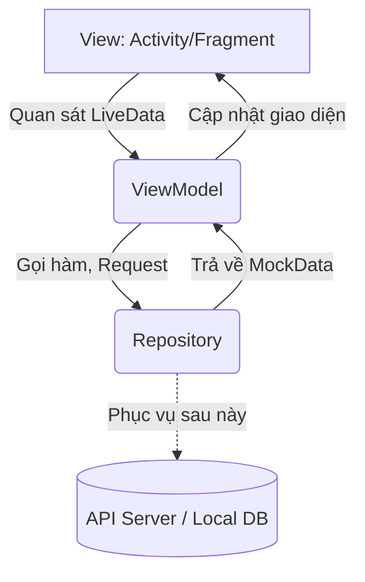
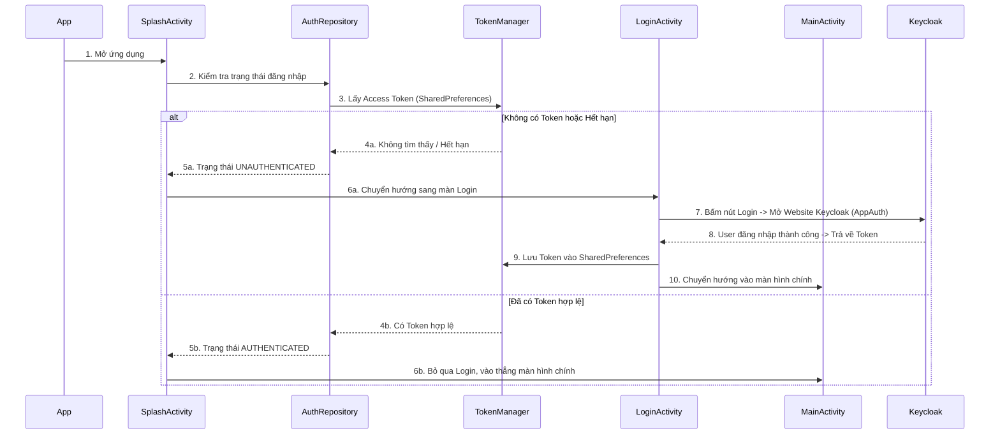

# 📱 WhatsApp Clone - Đồ Án Lập Trình Di Động (Nhóm 4)

Dự án này là một bản sao (clone) của ứng dụng nhắn tin WhatsApp, được xây dựng cho hệ điều hành Android. Hiện tại, source code cung cấp sẵn **Bộ khung (Skeleton)** phía Client (Mobile App) hoàn chỉnh về giao diện (UI) và luồng hoạt động. 

Repository này sẽ là nơi làm việc chung của cả nhóm. Vui lòng đọc kỹ tài liệu này trước khi bắt đầu code.

---

## 🎯 Phần 1: Báo Cáo Source Base Hiện Tại (Architecture & Workflow)

Dự án hiện tại được xây dựng theo mô hình **MVVM (Model - View - ViewModel)** khuyên dùng bởi Google. Đây là chuẩn công nghiệp hiện nay cho app Android.

*   **View (UI):** Gồm Activity và Fragment. Chỉ chịu trách nhiệm hiển thị giao diện và nhận tương tác từ người dùng (click, gõ phím...). **Tuyệt đối không chứa logic xử lý nghiệp vụ hay gọi API trực tiếp ở đây.**
*   **ViewModel:** Nơi chứa logic xử lý (ví dụ: người dùng bấm nút thì ViewModel quyết định làm gì tiếp theo). Nó giữ trạng thái dữ liệu (bằng `LiveData` hoặc `StateFlow`) để View tự động cập nhật khi dữ liệu thay đổi.
*   **Repository:** Tầng giao tiếp với dữ liệu. Nhiệm vụ của nó là cung cấp dữ liệu cho ViewModel, bất kể dữ liệu đó đến từ đâu (Local Database, API thật, hay Mock Data). Hiện tại, nó đang trả về Mock Data.

### 1.1. Luồng Hoạt Động Ứng Dụng (Workflow)

Dưới đây là luồng hoạt động chính khi người dùng mở ứng dụng lên:

### 1.2. Kiến Thức Cần Nắm Vững (Prerequisites)

Để phát triển tiếp dự án này, các thành viên (đặc biệt là team Frontend) cần tìm hiểu và nắm chắc các kiến thức sau:

1.  **Core Android:**
    *   **Vòng đời (Lifecycle):** Hiểu rõ vòng đời của `Activity` và `Fragment` (onCreate, onStart, onResume...) để tránh memory leak.
    *   **Intent:** Cách chuyển đổi giữa các màn hình và truyền dữ liệu cơ bản.
    *   **SharedPreferences:** Cách luân chuyển, đọc/ghi dữ liệu tạm thời (đang dùng để lưu Access/Refresh Token).
2.  **UI & Components:**
    *   **RecyclerView & Adapter:** Rất quan trọng! Hầu hết mọi danh sách (danh sách chat, danh bạ, tin nhắn) đều dùng `RecyclerView`. Cần hiểu cách viết `Adapter` và `ViewHolder`.
    *   **ViewBinding:** Thay thế cho `findViewById` truyền thống. Giúp linh kết giữa logic Java và file XML layout an toàn và code sạch hơn.
    *   **BottomNavigationView & ViewPager2:** Dùng để làm các tab chức năng ở dưới đáy màn hình chính.
3.  **Kiến trúc MVVM & Jetpack Component:**
    *   Cách khởi tạo và sử dụng `ViewModel`.
    *   Cách dùng `LiveData` (hoặc `MutableLiveData`) để View có thể `Observe` (quan sát) và tự động cập nhật UI khi có dữ liệu mới từ data layer.
4.  **Network & Security (Chuẩn bị cho bước tiếp theo):**
    *   **Retrofit & OkHttp:** Đây là 2 thư viện lõi dùng để call API đến Spring Boot Server sau này. Cần biết cách định nghĩa các Interface API, tạo Retrofit Client, và thêm Headers (Interceptors).
    *   **OAuth2 / OpenID Connect:** Hiểu luồng cơ bản (Authorization Code Flow với PKCE) mà thư viện `AppAuth` đang dùng để liên kết bảo mật với Keycloak.

### 1.3. Cấu Trúc Mã Nguồn & Mục Đích Từng File

Source code đã được phân chia theo kiến trúc package (`package by feature/layer`) để dễ quản lý.

#### 🗂️ `network/` (Tầng Mạng & Security)
Chuyên xử lý cấu hình kết nối server và các logic bảo mật API chung.
*   **`KeycloakConfig.java`**: File chứa hằng số cấu hình: Server URL của Keycloak, Realm, Client ID, Redirect URI.
*   **`TokenManager.java`**: Lớp tiện ích (Utility) dùng SharedPreferences để `saveToken()`, `getAccessToken()`, `clearToken()`.
*   **`AuthInterceptor.java`**: (Quan trọng về sau) Dùng với OkHttp. Tự động chèn header `Authorization: Bearer <token>` vào mọi API requests gửi lên Server.

#### 🗂️ `model/` (Dữ liệu - Data Entities)
Các class POJO thuần tuý đại diện cho các Object trong ứng dụng (tương tự như các bảng dưới Database).
*   **`User.java`**: Người dùng (ID, tên, sđt, avatar...).
*   **`Message.java`**: Một tin nhắn (Nội dung, thời gian, thuộc về ai, loại tin nhắn: Text/Image, Trạng thái: Đã gửi/Đã xem...).
*   **`Conversation.java`**: Một đoạn chat (chứa `User` đối tác và `Message` mới nhất để hiện ở trang chủ).
*   **`Group.java`**: Nhóm chat.
*   **`FriendRequest.java`**, **`Notification.java`**: Mô hình yêu cầu kết bạn và thông báo hệ thống.

#### 🗂️ `repository/` (Tầng kết nối dữ liệu - Data Layer)
Hiện tại dự án chưa có API, nên tầng này đang làm nhiệm vụ "giả mạo" Server (ngoại trừ AuthRepository đang kết nối Keycloak thật).
*   **`AuthRepository.java`**: Trung tâm xử lý logic OAuth2 bằng thư viện AppAuth (chuẩn bị Request, gửi đến Keycloak, nhận Token đổi trả).
*   **`ChatRepository.java`**: Chứa các hàm `getConversations()`, `getMessages(...)`. Nó đang gọi đến `MockData`.
*   **`UserRepository.java`**: Lấy danh bạ bạn bè, danh sách block...
*   **`NotificationRepository.java`**: Lấy thông báo giả.
> 🔥 **Nhiệm vụ của team API:** Sau khi Backend có API thật, các bạn sẽ tạo các `Interface Retrofit` và thay đổi các `Repository` này. Xoá việc trả về `MockData`, thay vào đó là gọi Retrofit `enqueue()` để lấy Data JSON thật về.

#### 🗂️ `util/` (Công cụ dùng chung - Utilities)
*   **`MockData.java`**: File này chứa dữ liệu tĩnh cực lớn (giả lập các user, avatar, tin nhắn có sẵn) giúp Frontend có thể chạy và thiết kế UI mượt mà ngay cả khi chưa có Backend. Khi có Server thật, file này sẽ bị xoá đi.

#### 🗂️ `viewmodel/` (Điều phối Logic Màn Hình - Presentation Layer)
Nằm tầng giữa, kết nối View và Repository.
*   **`AuthViewModel.java`**: ViewModel dùng để quản lý trạng thái (`LOADING`, `AUTHENTICATED`, `UNAUTHENTICATED`) cung cấp cho View.
*   Mỗi màn hình có 1 ViewModel tương ứng (Ví dụ: `ChatListViewModel`, `ConversationViewModel`, `ContactsViewModel`...). Các class này làm nhiệm vụ: `View` gọi -> `ViewModel` báo `Repository` lấy dữ liệu -> Có dữ liệu thì nạp vào `LiveData` -> `View` tự động thấy `LiveData` đổi và vẽ lại UI lên màn hình.

#### 🗂️ `view/` (Giao Diện UI)
Chứa toàn bộ các File để vẽ ra màn hình app, phân rã thành Activity, Fragment và Adapter.

**`view/activity/` (Các màn hình độc lập hoàn chỉnh)**
*   **`SplashActivity.java`**: Màn hình chớp lên khi mở app, có logo. Nghĩa vụ chính: Hỏi `AuthViewModel` xem có Token chưa để quyết định vào trang nào tiếp.
*   **`LoginActivity.java`**: Hiện nút đăng nhập bằng Keycloak. Khi bấm, mở in-app browser chạy OAuth2.
*   **`MainActivity.java`**: Khu vực xương sống. Có thanh điều hướng `BottomNavigationView` ở đáy để switch qua lại giữa 4 tab mà không phải mở Activity mới.
*   **`ConversationActivity.java`**: Màn hình khung chat nhắn tin (1-to-1 hoặc Group). Tính năng phức tạp nhất sẽ nằm ở đây.
*   Và các màn hình lẻ khác: `UserProfileActivity` (Xem thông tin bạn bè), `BlockedUsersActivity`, `CreateGroupActivity`...

**`view/fragment/` (Các mảnh màn hình nhúng vào MainActivity)**
Tương ứng với 4 nút dưới đáy màn hình của `MainActivity`:
*   **`ChatListFragment.java`**: Tab 1 - HIển thị lịch sử chat.
*   **`ContactsFragment.java`**: Tab 2 - Danh bạ bạn bè.
*   **`MyProfileFragment.java`**: Tab 3 - Thông tin cá nhân của mình.
*   **`SettingsFragment.java`**: Tab 4 - Cài đặt (Bong nổi ngôn ngữ, theme, v.v..). Nút Đăng Xuất nằm tại đây (gọi AuthRepository để xóa Token).

**`view/adapter/` (Bộ ghép nối dữ liệu vào Danh sách UI)**
Như đã nói, Android dùng `RecyclerView`, yêu cầu phải có Adapter hướng dẫn nó "Dữ liệu X thì vẽ lên Khung UI kiểu Y như thế nào".
*   **`MessageAdapter.java`**: Rất quan trọng! Xử lý logic chia 2 loại tin nhắn: Nếu `senderId` là Id của bản thân -> Vẽ cái khung xanh lá nằm sát mép phải. Nếu `senderId` là người khác -> Vẽ khung trắng nằm sát mép trái có kèm hình Avatar.
*   **`ConversationAdapter.java`**: Vẽ Danh sách lịch sử chat ở Tab 1.
*   Các file Adapter khác tương tự (`UserAdapter`, `FriendRequestAdapter`...) dùng để render Layout cho các List khác nhau.

**=> Tóm lại:** Source này là "**vỏ đẹp, ruột giả**". Phần UI và Flow gần như đã setup chuẩn 100%. Công việc tiếp theo của các bạn là gỡ các class gọi `MockData` ra, và thay thế bằng việc call API Retrofit.

---

## 📋 Phần 2: Kế Hoạch & Phân Chia Công Việc

Nhiệm vụ trọng tâm của đồ án không phải là làm lại UI (vì đã có sẵn), mà là **tạo Server thật** và **thay thế dữ liệu giả (Mock) thành dữ liệu thật (API)** từ backend đó.

### 👤 Thành Viên 1: Backend Developer (Trọng tâm)
Thiết kế và xây dựng Server để Mobile App kết nối vào.
*   **Công nghệ:** Spring Boot, PostgreSQL/MySQL, Keycloak Server (Docker/Local).
*   **Nhiệm vụ chính:** 
    * Xây dựng DB chứa Bảng User, Bảng Tin Nhắn, Bảng Chat.
    * Tạo các REST API (`/api/users`, `/api/conversations/...`).
    * Setup WebSocket Server để bắn event tin nhắn thời gian thực.
    * Gắn Keycloak dùng cho việc định danh.
    * Hỗ trợ API cho các tính năng tìm kiếm và thông báo.

### 👤 Thành Viên 2: API Integration (Thợ nối ống)
Xoá bỏ `MockData`, đấu nối Mobile với Backend thật.
*   **Công nghệ:** Retrofit2, OkHttp3, Gson.
*   **Nhiệm vụ chính:**
    * Sửa thông số trong `KeycloakConfig` trỏ tới Server thật.
    * Tạo `ApiService.java` chứa các Endpoint API giống hệt Server cung cấp.
    * Vào thư mục `repository/` để xóa code tĩnh, viết lại bằng hàm `enqueue()` của Retrofit.
    * Bắt các sự kiện Loading, Error để đổi giao diện `ViewModel`.

### 👤 Thành Viên 3: UI Polish & Media (Chuyên gia Hình ảnh)
Nâng cấp đồ họa và xử lý mảng Media (chụp/nhận file tải lên).
*   **Công nghệ:** Glide, Android Intent (Camera/Gallery).
*   **Nhiệm vụ chính:**
    * Đưa thư viện Glide vào dự án để thay thế việc load ảnh nội bộ bằng load ảnh qua URL (`User.java` sửa `avatarResId` thành `avatarUrl`).
    * Viết tính năng bấm đổi Avatar `MyProfileFragment`, Upload ảnh máy ảnh.
    * Bổ sung Skeleton Loading và các animation chuyển trang cho app có cảm giác xịn xò.
    * Nâng cấp `MessageAdapter` hiển thị được loại tin nhắn hình ảnh.

### 👤 Thành Viên 4: Real-time Messaging (Real-time Kỹ sư)
Làm cho app "Sống".
*   **Công nghệ:** OkHttp WebSocket, FCM (Firebase Cloud Messaging), Room.
*   **Nhiệm vụ chính:**
    * Viết client WebSocket bằng OkHttp kết nối đến Backend Server.
    * Làm trạng thái "Đang gõ... (Typing)" và "Trực tuyến (Online)".
    * Xử lý Push Notification khi có tin nhắn tới (nếu không mở app) bằng Firebase FCM.
    * (Nâng cao) Dùng thư viện `Room` Database lưu tạm tin nhắn offline.

---

## 🌳 Phần 3: Quy Tắc Git & Version Control

Để tránh xung đột code (Conflict) đến mức đập máy nội bộ, nhóm tuân thủ chặt Flow làm việc sau:

### 3.1. Phân chia Nhánh (Branching Model)
*   **`main`**: Nhánh CHÍNH (Production). Code ở đây bắt buộc phải chạy được, không lỗi build. TUYỆT ĐỐI KHÔNG commit thẳng lên main.
*   **`develop`**: Nhánh TỔNG HỢP tính năng. Code mới sẽ về đây test trước.
*   Nhánh Tính năng cá nhân: **`feature/tên-ngắn-chức-năng`**. Ví dụ: 
    *   `feature/tv2-retrofit-setup`
    *   `feature/tv4-websocket-chat`
    *   `feature/tv3-glide-avatar`

### 3.2. Luồng làm việc chuẩn (Workflow)
1. **Trước khi bắt đầu code mỗi ngày:** 
   *   Mở Terminal gõ: `git checkout develop`, rồi `git pull origin develop` để lấy code mới nhất mà người khác vừa gom vào.
2. **Tạo nhánh làm việc riêng:** 
   *   `git checkout -b feature/ten-viec-se-lam`
3. **Trong quá trình code:**
   *   `git add .`
   *   `git commit -m "feat(module): Nội dung bạn đã làm gì"`
4. **Khi xong tính năng:**
   *   `git push origin feature/ten-viec-se-lam`
   *   Mở link GitHub/GitLab, nhấn nút **Create Pull Request (PR)** gửi vào nhánh `develop`. Trưởng nhóm hoặc người chéo cánh sẽ review code trước khi gộp (Merge).

### 3.3. Quy Tắc Ghi Commit Message (Conventional Commits)
Commit rõ ràng giúp mình 1 tháng sau và người khác đọc hiểu ngay mình làm gì.
Cú pháp: `[thẻ]: [nội dung mô tả]`

*   `feat: thêm tích xanh đã đọc đoạn chat` (Tính năng mới)
*   `fix: sửa lỗi crash khi chưa có internet` (Sửa lỗi/Bug)
*   `refactor: đổi vị trí thư mục auth` (Dọn dẹp lại code)
*   `docs: cập nhật README` (Chỉ viết tài liệu)
*   `chore: update thư viện Glide lên ver 4` (Các việc lặt vặt build/thư viện)

**🔥 LUÔN NHỚ:** Nếu lỡ bị Conflict, bình tĩnh báo anh em mở Android Studio (Phần Git) lên Resolve từng dòng một, không dùng lệnh bậy ép gộp văng mất đồ án nhé! Thắng bại tại kỹ năng Git!

---
*Chúc đội 4 người thành công và được điểm tối đa với môn Lập trình di động!* 🚀
